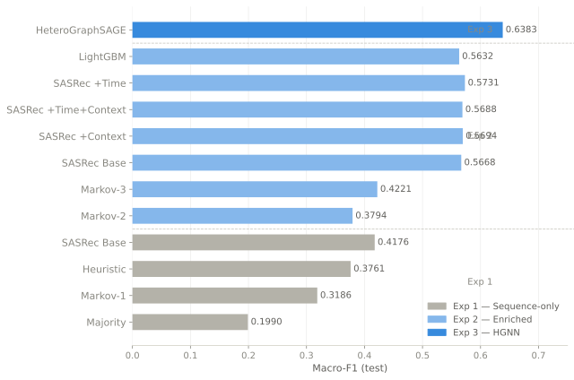

# Heterogeneous Graph Neural Networks for User Journey Modeling

A double-degree master's thesis submitted to the Transport and
Telecommunication Institute (TSI), Riga, and the University of the
West of England (UWE Bristol), 2026.

**Author:** Dmitrijs Gizdevans
**Supervisor:** Dmitry Pavlyuk

---

## Research Overview

This work investigates prefix-level e-commerce session behaviour
classification — predicting a user's behavioural type from an incomplete
session observed up to event t. Four mutually exclusive classes are
distinguished using a deterministic labelling hierarchy applied to GA4
clickstream data:

| Class | Definition |
|---|---|
| Buyer | Session contains a purchase event |
| Intent | No purchase, but contains cart or checkout events |
| Researcher | No purchase/cart, but ≥ 3 product interactions |
| Browser | All remaining sessions |

The central hypothesis: a heterogeneous graph neural network that
explicitly encodes relationships between events, pages, and items
outperforms flat sequential and feature-based approaches on this task,
particularly for minority classes (Buyer, Intent).

---

## Data

All experiments use the Google Analytics 4 public e-commerce dataset
available on Google BigQuery: 'bigquery-public-data.ga4_obfuscated_sample_ecommerce.events_*'

A free Google Cloud Platform account is sufficient to access this dataset.
360,129 sessions · 92 days (Nov 2020 – Jan 2021) · temporal split 70/15/15.
No data files are included in this repository.

---

## Experimental Progression

### Experiment 0 — Sanity Check
[`exp0_sanity_check/`](exp0_sanity_check/)

Binary purchase prediction on complete sessions using static engineered
features. Logistic Regression and Random Forest both achieve ROC-AUC > 0.98,
confirming the dataset contains sufficient predictive signal to proceed.

---

### Experiment 1 — Sequence-Only Baselines
[`exp1_sequential/`](exp1_sequential/)

Establishes a performance ceiling using only the ordered sequence of
event names as input. Three models evaluated: Majority baseline,
rule-based Heuristic, Markov(1), and SASRec transformer.

| Model | Test Macro-F1 |
|---|---|
| Majority baseline | 0.1990 |
| Markov(1) | 0.3186 |
| Heuristic | 0.3761 |
| SASRec Base | 0.4176 ± 0.0011 |

---

### Experiment 2 — Enriched Baselines
[`exp2_enriched/`](exp2_enriched/)

Enriches the input representation with temporal intervals, contextual
features (device, geography, traffic source), and higher-order Markov
chains. Adds LightGBM with 219 engineered features. SASRec extended
with four ablation variants.

| Model | Test Macro-F1 |
|---|---|
| Markov(2) | 0.3794 |
| Markov(3) | 0.4221 |
| LightGBM | 0.5632 |
| SASRec Base | 0.5668 ± 0.0047 |
| SASRec +Context | 0.5694 ± 0.0019 |
| SASRec +Time+Context | 0.5688 ± 0.0059 |
| SASRec +Time | **0.5731 ± 0.0021** |

LightGBM and SASRec +Time converge within 0.01 Macro-F1 despite
fundamentally different architectures. Pairwise prediction agreement
between them reaches 0.918, pointing to a representational bottleneck
in flat sequence encoding rather than model-specific limitations.

---

### Experiment 3 — Heterogeneous Graph Neural Network
[`exp3_hgnn/`](exp3_hgnn/)

Replaces the flat event sequence with a heterogeneous graph per prefix.
Three node types (Event, Page, Item) and five edge types encode
navigational and commercial interactions. The HeteroGraphSAGE model
applies two-layer message passing, then classifies from the last event
embedding concatenated with a session-level feature vector.

| Model | Test Macro-F1 |
|---|---|
| HeteroGraphSAGE | **0.6383 ± 0.0059** |

Outperforms the best non-structural baseline (SASRec +Time) by +0.065.
Minority class gains: Buyer +0.104, Intent +0.093.

---

## Summary of Results

| Exp | Best Model | Test Macro-F1 |
|---|---|---|
| 1 | SASRec Base | 0.4176 ± 0.0011 |
| 2 | SASRec +Time | 0.5731 ± 0.0021 |
| 3 | HeteroGraphSAGE | **0.6383 ± 0.0059** |

---

## Publication

Gizdevans, D. (2026). Heterogeneous Graph Neural Networks for User Journey
Modeling: A Comparative Study with Sequential and Probabilistic Approaches.
*Research and Technology – Step into the Future*, Vol. 21, No. 1, p. 59.
The 49th RaTSiF Conference, April 24, 2026, TSI, Riga.
See [`publications/`](publications/).

## Thesis

Full thesis document — TBD after defense.
